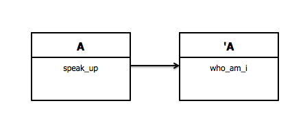
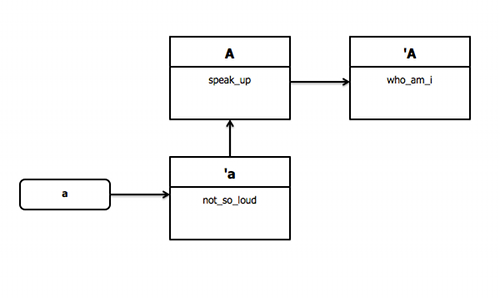
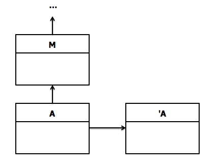
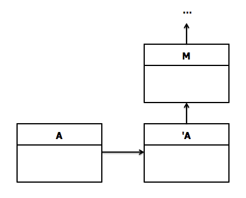

!SLIDE title-slide
## Inside Ruby: ##
## An In Depth Understanding of Modules ##

# Luke Cowell #
## @lukecowell

!SLIDE bullets incremental

# Outline #

* Easy
* Not So Easy
* Best Practices

!SLIDE smaller
# include & methods
    @@@ Ruby
    module Foo
      def say
        puts "say!" 
      end

      def self.cow_say
        puts "moo"
      end
    end

    class Bar
      include Foo
    end

    b = Bar.new
    b.say # "say!" 
    Bar.cow_say # NoMethodError

!SLIDE smaller
# instance variables 
    @@@ Ruby
    module Foo
      @name # nil
      def say
        puts @name
      end
    end

    class Bar
      include Foo

      def initialize
        @name = "Lucas"
      end
    end

    b = Bar.new
    b.say # "Lucas"

!SLIDE smaller incremental
    
    @@@ Ruby
    module Foo
      def say(word)
        puts word
      end
    end

    class Bar
      extend Foo
    end

    b = Bar.say("goodbye") # goodbye

!SLIDE smaller

# Name::Spacing
    @@@ ruby
    module A
      class B
      end
    end

    class C
      class D <  A::B
      end
    end

    A::B.new
    C.new
    C::D.new

!SLIDE smaller

    @@@ Ruby
    module Contactable
      def name
        #some code
      end
      module ClassMethods
        def find(name)
          # snip
        end
      end
    end

    class User
      include Contactable
      extend Contactable::ClassMethods
    end
    
    u = User.find("Lucas")
    u.name # => "Lucas"

!SLIDE smaller

    @@@ Ruby
    module Contactable
      def self.included(klass)
        klass.extend(ClassMethods)
      end

      def name
      end

      module ClassMethods
        def find(name)
        end
      end
    end

    class User
      include Contactable
    end

    u = User.find("Lucas")
    u.name # => "Lucas"

!SLIDE smaller

    @@@ Ruby
    module Contactable
      attr_accessor :name
      validates_presence_of :name
      #...snip
    end

    class User < ActiveRecord::Base
      include Contactable
    end
    
    # undefined method `validates_presence_of'

!SLIDE smaller

    @@@ Ruby
    module Contactable
      def self.included(klass)
        klass.class_eval do
          attr_accessor :name
          validates_presence_of :name
        end
        #...snip
      end
    end

    class User
      include Contactable
    end

    u = User.new
    u.valid? # false
    u.name = "Lucas"
    u.valid? # true

!SLIDE smaller
# Extending Instances

    @@@ ruby
    class Foo
    end

    module Bar
      def hello
        "Hello!"
      end
    end

    f = Foo.new
    f.extend(Bar)

    f.hello # => "Hello!"

!SLIDE smaller

# extending your understanding of modules
    @@@ ruby
    class A
      def self.who_am_i
        puts self
      end
    
      def speak_up(input)
        puts input.upcase
      end
    end
    $ A.instance_methods(false) # [:speak_up]
    $ A.singleton_methods # => [:who_am_i]
    $ A.singleton_class # #<Class:A>
_http://ficate.com/explaining-include-and-extend_

!SLIDE smaller

    @@@ ruby
    a = A.new
    
    def a.not_so_loud(input)
      puts input.downcase
    end

    a.singleton_methods # [:not_so_loud]
    a.singleton_class.superclass # A

!SLIDE commandline incremental

# _include_

!SLIDE commandline incremental

# _extend_

!SLIDE smaller

    @@@ ruby
    module Quiet
      def not_so_loud(input)
        puts input.downcase
      end
    end

    a = A.new
    a.extend(Quiet)

!SLIDE

# Method lookup order:
# Live Code!

!SLIDE smaller incremental bullets

# extend self
    @@@ ruby
    module Beer
      extend self

      def drink
        puts "don't mind if I do."
      end
    end
* self.extend(self)
* Beer.extend(Beer)

!SLIDE smaller

    @@@ ruby

    module Beer
      extend self

      def drink 
      end
    end

    module Beer
      def self.drink
      end
    end

!SLIDE smaller
# Excuse me, your scope is flat

    @@@ ruby
    #... inside another class
    @data = "Luke"
   
    module BrokenFilter
      def name
        @data
      end
    end
    self.working_filter = Module.new do
      define_method :name do
        @data
      end
    end

    class Document
      include Filter.working_filter
    end

!SLIDE incremental bullets small

# Module Guidelines 

* Use modules for attributes, use inheritance when the objects are related
* Use methods instead of instance variables
* Use a thin interface between the class and included module

!SLIDE

# ::END

Thank you!
